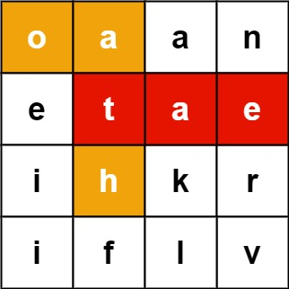
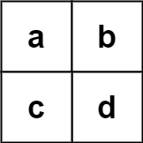

Given an `m x n` `board` of characters and a list of strings `words`, return _all words on the board_.

Each word must be constructed from letters of sequentially adjacent cells, where **adjacent cells** are horizontally or vertically neighboring. The same letter cell may not be used more than once in a word.

**Example 1:**



```
Input board = [["o","a","a","n"],["e","t","a","e"],["i","h","k","r"],["i","f","l","v"]], words = ["oath","pea","eat","rain"]
Output ["eat","oath"]
```

**Example 2:**



```
Input board = [["a","b"],["c","d"]], words = ["abcb"]
Output []
```

**Constraints:**

-   `m == board.length`
-   `n == board[i].length`
-   `1 <= m, n <= 12`
-   `board[i][j]` is a lowercase English letter.
-   `1 <= words.length <= 3 * 10^4`
-   `1 <= words[i].length <= 10`
-   `words[i]` consists of lowercase English letters.
-   All the strings of `words` are unique.
